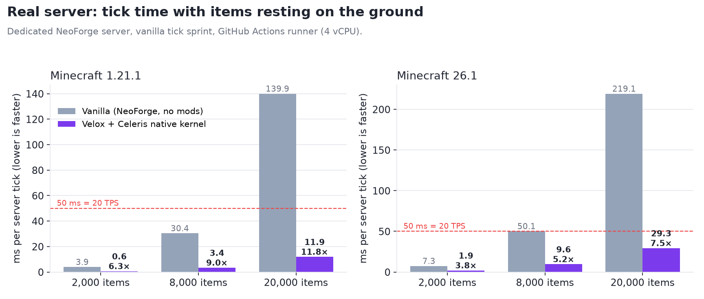
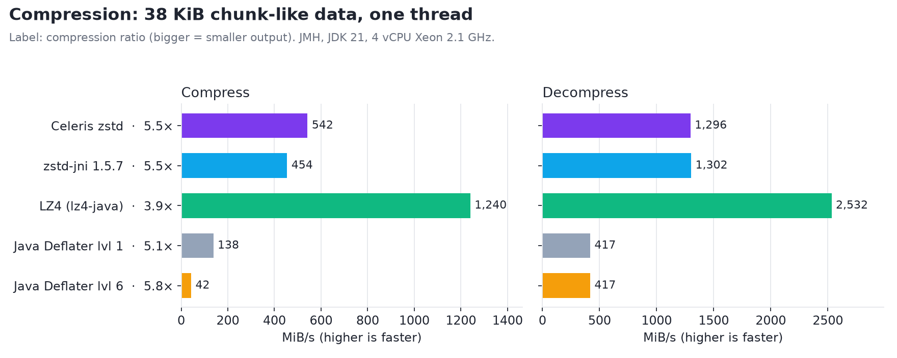
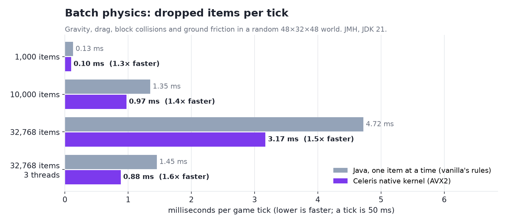
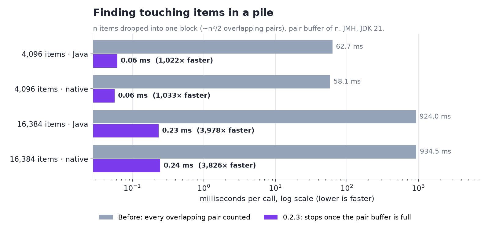
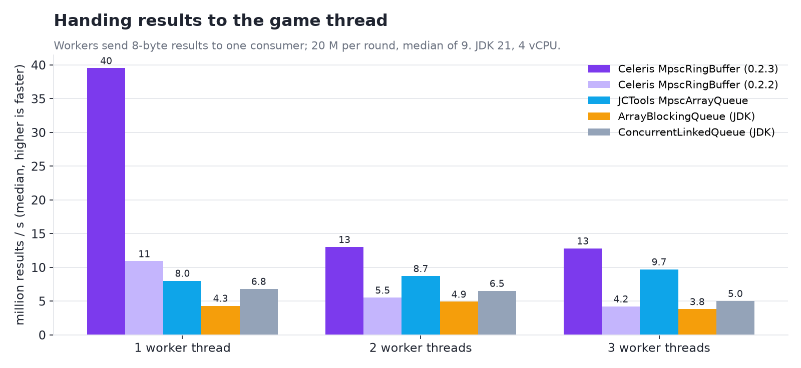

# Celeris benchmarks

How Celeris's building blocks compare with what a mod would otherwise use: the JDK's own classes and the best-known
Java libraries for the same job, and what that adds up to on a real server. Every number below comes from the code in
[`benchmarks/`](../benchmarks) and the raw results in [`benchmarks/results/`](../benchmarks/results);
`benchmarks/run.sh` reproduces the JMH ones and redraws the charts. The in-game numbers come from
panzer-build-logic's `perf-test` workflow.

**Measured:** 2026-10-08, Celeris 0.2.3 (commit 4586d93) with Velox 0.1.0. **Machine:** 4 vCPU Intel Xeon @ 2.1 GHz
(shared cloud VM, AVX2), Linux, OpenJDK 21. **Harness:** JMH 1.37, 1 fork, 3 × 1 s warm-up, 5 × 1 s measurement
(± is JMH's 99.9 % error). A shared VM is noisy: read differences under ~20 % as a tie. Your numbers will differ; the
ratios are what matter.

## Summary

| Job | Celeris | Compared with | Result |
|---|---|---|---|
| A server with 20,000 dropped items, Minecraft 1.21.1 | 11.9 ms per tick (Velox + native kernel) | 139.9 ms, vanilla NeoForge | **11.8× faster**, from 3 TPS to a full 20 |
| The same on Minecraft 26.1 | 29.3 ms per tick | 219.1 ms, vanilla NeoForge | **7.5× faster** |
| Compressing mod data (38 KiB) | native zstd, 542 MiB/s, ratio 5.5× | Java `Deflater` level 6 (what Minecraft uses), 42 MiB/s, ratio 5.8× | **12.8× faster** for nearly the same size |
| Decompressing it | 1,296 MiB/s | Java `Inflater`, 417 MiB/s | **3.1× faster** |
| Same, vs zstd-jni 1.5.7 | 542 / 1,296 MiB/s | 454–489 / 1,218–1,302 MiB/s | **tie**: same zstd 1.5.7 underneath, in a 2 MB jar instead of a 7.4 MB one |
| Moving 10,000 dropped items one tick | 0.97 ms (native kernel) | 1.35 ms (same rules in Java, item by item) | **1.4× faster** |
| 32,768 items on 3 threads | 0.88 ms | 4.72 ms (Java, one thread) | **5.3× faster**, under 2 % of a 50 ms tick |
| Finding touching items in a pile of 16,384 | 0.24 ms | 860–1,100 ms (every pair counted, as before 0.2.3) | **~4,000× faster** |
| One worker handing results to the game thread | 39.5 M/s | JCTools `MpscArrayQueue` 8.0 M/s, `ArrayBlockingQueue` 4.3 M/s | **4.9× faster** than JCTools |
| Two or three workers at once | 13.0 / 12.8 M/s | JCTools 8.7 / 9.7, `ArrayBlockingQueue` 4.9 / 3.8 | **1.3–1.5× faster** than JCTools |

Where Celeris is not the fastest, this page says so: LZ4 compresses 2.3× faster than zstd, at the price of output about
40 % larger (3.9× instead of 5.5×). The native physics kernel is 7–20 % slower than in the previous build of this
page, because it now checks every item for impossible values and computes block coordinates without undefined
behaviour (see [Batch physics](#batch-physics)); on a real server that is lost in the rest of the tick.

## A real server

A dedicated NeoForge server on a GitHub Actions runner (4 vCPU), flat world, N swords thrown over a 112 × 112 area
(swords never stack, so every configuration keeps all of them). Vanilla's `tick sprint` runs ticks back to back and
reports the average milliseconds per tick: *falling* is the first 80 ticks after the throw, *resting* 1,200 ticks
later with everything on the ground. Milliseconds per tick, lower is better; 50 ms is the 20 TPS budget:

| Minecraft | Items | Vanilla falling / resting | Velox (native kernel) falling / resting | Speed-up |
|---|---|---|---|---|
| 1.21.1 | 2,000 | 5.43 / 3.92 | 0.93 / 0.62 | 5.8× / 6.3× |
| 1.21.1 | 8,000 | 39.45 / 30.37 | 6.34 / 3.38 | 6.2× / 9.0× |
| 1.21.1 | 20,000 | 171.52 / 139.95 | 17.48 / 11.91 | 9.8× / 11.8× |
| 26.1 | 2,000 | 9.80 / 7.34 | 2.53 / 1.92 | 3.9× / 3.8× |
| 26.1 | 8,000 | 64.30 / 50.10 | 14.71 / 9.55 | 4.4× / 5.2× |
| 26.1 | 20,000 | 255.86 / 219.13 | 37.42 / 29.30 | 6.8× / 7.5× |

With Celeris's Java kernel instead of the native one the server is within a few percent (20,000 items resting:
13.39 ms on 1.21.1, 28.57 ms on 26.1): the item physics itself is now a small part of the tick, and what remains is
Minecraft's own per-entity work (chunk ticking checks, entity tracking, fluid checks), which Velox leaves to the
game. On 26.1, 0.2.3's Velox also skips the per-item "entity inside block" walk for items over plain blocks, which
took 4× to 7.5× at 20,000 resting items.

## Compression

Synthetic chunk-section data (NBT-like palettes and block states, see `ChunkData.java`) at three sizes: one network
packet (3 KiB), one chunk (38 KiB) and a region-sized blob (1 MiB). Time per operation in µs, lower is better:

| | 3 KiB | 38 KiB | 1 MiB |
|---|---|---|---|
| **Celeris zstd, compress** (JNI binding, Java 21 without flags) | **10.7 ± 1.5** | **68.5 ± 12.1** | **2,814 ± 609** |
| Celeris zstd, compress (FFM binding, `--enable-preview` / Java 25) | 12.5 ± 8.9 | 74.9 ± 23.0 | 2,838 ± 640 |
| zstd-jni 1.5.7-6, compress (`byte[]`) | 11.8 ± 3.4 | 81.7 ± 58.0 | 3,132 ± 887 |
| zstd-jni 1.5.7-6, compress (direct buffers) | 11.9 ± 4.4 | 75.9 ± 24.5 | 2,800 ± 446 |
| LZ4 (lz4-java 1.8.0, fast), compress | 3.0 ± 0.2 | 29.9 ± 1.6 | 1,793 ± 473 |
| Java `Deflater` level 1, compress | 19.6 ± 5.7 | 269.5 ± 38.4 | 8,392 ± 1,322 |
| Java `Deflater` level 6, compress | 56.0 ± 11.0 | 873.6 ± 176.7 | 25,075 ± 4,713 |
| **Celeris zstd, decompress** (JNI) | **5.3 ± 0.7** | **28.6 ± 6.9** | **959 ± 134** |
| Celeris zstd, decompress (FFM) | 5.3 ± 0.7 | 27.6 ± 5.5 | 996 ± 261 |
| zstd-jni, decompress (`byte[]`) | 5.9 ± 1.6 | 28.5 ± 10.2 | 1,081 ± 434 |
| zstd-jni, decompress (direct) | 5.4 ± 0.9 | 30.5 ± 13.3 | 1,072 ± 476 |
| LZ4, decompress | 1.8 ± 0.1 | 14.7 ± 2.1 | 470 ± 88 |
| Java `Inflater` | 8.3 ± 1.0 | 88.9 ± 22.9 | 2,910 ± 417 |

Compression ratio (original ÷ compressed):

| | 3 KiB | 38 KiB | 1 MiB |
|---|---|---|---|
| zstd level 3 (Celeris and zstd-jni) | 4.43 | 5.51 | 6.38 |
| Deflater level 6 | 4.81 | 5.83 | 6.30 |
| Deflater level 1 | 4.22 | 5.07 | 5.37 |
| LZ4 | 2.95 | 3.88 | 4.35 |

What this means: zstd gives deflate-level-6 sizes at better-than-level-1 speed. Celeris's own binding costs nothing
over zstd-jni's (both are one native call into the same library, with pooled contexts), and it ships inside a 2 MB jar
that also carries the physics kernel and every platform's natives. Packets between players still use deflate, so
clients and servers on different Java versions always agree; zstd is for mods' own data (saves, caches, bulk
transfers).

## Batch physics

One game tick of N dropped items in a random 48×32×48 block world: gravity, drag, collision with blocks and ground
friction, following vanilla's item movement rules. The items are thrown again every 40 ticks so the batch never just
rests. "Java" is Celeris's pure-Java kernel, which applies the rules one item at a time the way vanilla does; it does
not include the rest of vanilla's per-entity cost (entity ticking, events, tracking), so vanilla itself is slower
still. Time per tick in µs:

| Items | Java kernel | Native kernel (AVX2) | Speed-up |
|---|---|---|---|
| 1,000 | 129.5 ± 49.4 | 97.3 ± 14.7 | 1.3× |
| 10,000 | 1,349.5 ± 321.7 | 973.3 ± 235.6 | 1.4× |
| 32,768 | 4,721.0 ± 2,058.9 | 3,171.3 ± 489.3 | 1.5× |
| 32,768, 3 worker threads | 1,454.3 ± 427.3 | 882.6 ± 163.5 | 1.6× (5.3× vs one Java thread) |

Both kernels now refuse items whose position, speed or size is not a finite, plausible number (NaN, infinity,
1e300, billions of blocks away) and leave them to vanilla, and they compute block coordinates through a clamp, so no
input can make them read or write outside their buffers or hit undefined behaviour in C++. That costs: measured in
the same session against the build before those checks, the step is 7–13 % slower at 10,000 items and 12–21 % at
32,768 (callgrind: +11 % instructions on the baseline ISA). Results for every normal item are unchanged, bit for
bit, between the Java and native kernels on every CPU (`PhysicsParityTest`), and AddressSanitizer/UBSan check the
native one on x86-64 and ARM in CI (`native-sanitizers.yml`).

The native kernel is picked automatically when the CPU and JVM allow it (AVX2, AVX-512 or NEON builds ship in the
jar); otherwise the Java kernel runs with identical results.

## Finding touching items

`BodyBatch.broadphase` lists the pairs of items whose boxes touch (merge candidates, pushing). A pile of n items in
one block is the worst case: nearly every pair touches, ~n²/2 of them. Before 0.2.3 every call counted them all;
now the scan stops once the pair buffer (here n pairs) is full, and reports that the list was cut. The pairs kept are
exactly the first ones of the full list, in the same order on the Java and native kernels. Time per call:

| Items | Kernel | Every pair counted (before) | Stops at the buffer (0.2.3) | Speed-up |
|---|---|---|---|---|
| 4,096 | Java | 62.7 ± 23.7 ms | 0.061 ± 0.025 ms | ~1,000× |
| 4,096 | native | 58.1 ± 8.8 ms | 0.056 ± 0.010 ms | ~1,000× |
| 16,384 | Java | 924 ± 534 ms | 0.232 ± 0.055 ms | ~4,000× |
| 16,384 | native | 934 ± 180 ms | 0.244 ± 0.046 ms | ~3,800× |

Once the scan stops early, what is left is hashing every item into a cell and sorting them by cell, the same work
on both kernels, so Java and native are level (the native broadphase is now compiled per ISA like the step; built for
the baseline ISA only it was 15–20 % behind Java here).

## Handing results to the game thread

The pattern Celeris is built around: worker threads produce 8-byte results (tickets, handles, packed positions) and
the game thread consumes them. Each round moves 20 million values through a 65,536-slot queue; producers spin when it
is full, the consumer when it is empty. Median of 9 rounds, in million values per second:

| Queue | 1 producer | 2 producers | 3 producers |
|---|---|---|---|
| **Celeris `MpscRingBuffer` (0.2.3)** | **39.5** | **13.0** | **12.8** |
| Celeris `MpscRingBuffer` (0.2.2) | 10.9 | 5.5 | 4.2 |
| JCTools `MpscArrayQueue` 4.0.5 | 8.0 | 8.7 | 9.7 |
| `ArrayBlockingQueue` (JDK) | 4.3 | 4.9 | 3.8 |
| `ConcurrentLinkedQueue` (JDK) | 6.8 | 6.5 | 5.0 |

Celeris stores the values themselves in off-heap slots; the object queues box each one into a `Long`, which is part of
their cost and is what a mod using them for primitive results pays too. 0.2.3 made the ring about 4× faster with one
producer: producers no longer read the consumer's position on every publish (they keep a cached limit), and each
slot's state word now sits next to its payload, so a hand-off touches one cache line instead of two. (The 0.2.2 row
was measured on the same machine on 2026-10-07; the others on 2026-10-08.)
